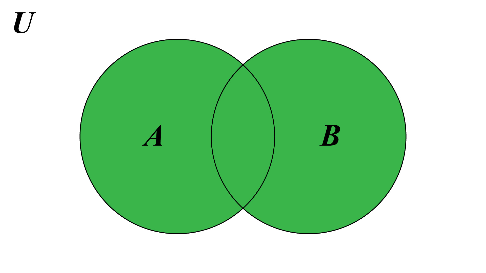
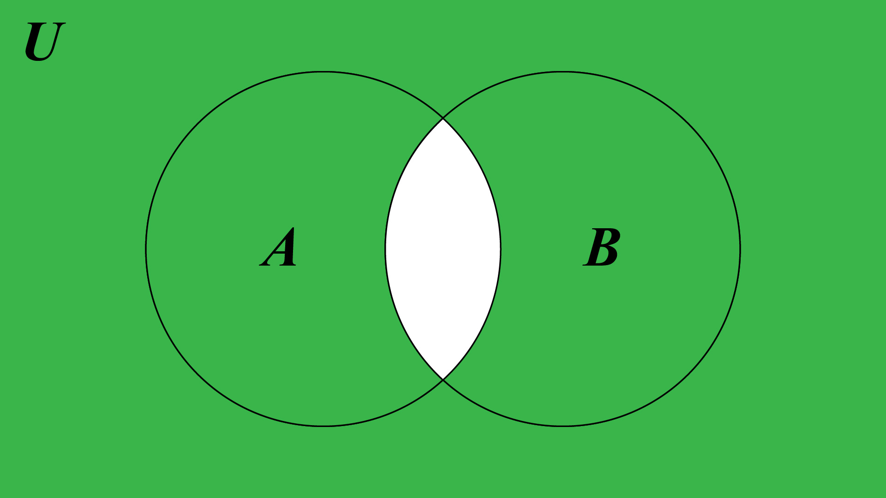
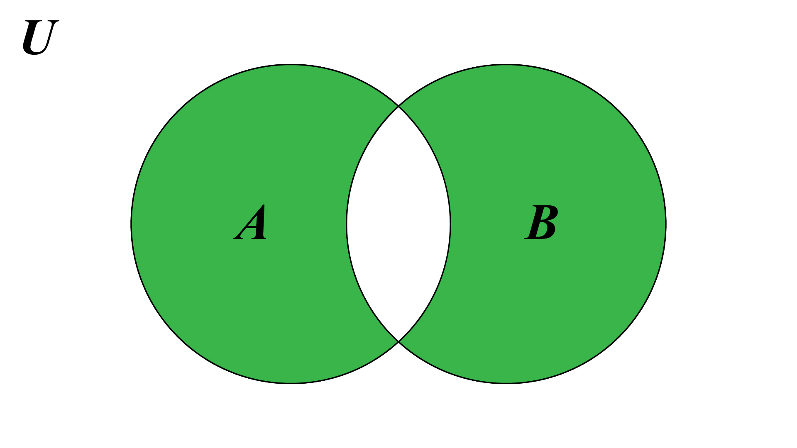
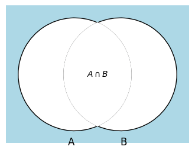

# Assignment 02

Muhammad Rifa Al Rizqul Aulia (10241050) 

Silahkan memilih dua problem berikut untuk diselesaikan.

## Problem 4 (50 poin)
Diberikan operator himpunan $?$ dan dua himpunan $A$ dan $B$ yang dikenai 
operator tersebut. Operator himpunan $?$ memiliki tabel keanggotaan sebagai
berikut 
| $A$ | $B$ | $A \operatorname{?} B$ |
|-----|-----|--------------|
| 1   | 1   | 0            |
| 1   | 0   | 1            |
| 0   | 1   | 1            |
| 0   | 0   | 0            |

Tunjukkan bahwa dua identitas berikut berlaku menggunakan diagram Venn
**dan** tabel keanggotaan
1. $A \operatorname{?} B = (A \cup B) \cap \overline{A \cap B}$
2. $A \operatorname{?} B = (A \cap \overline{B}) \cup (\overline{A} \cap B)$

### Answer
1. $A \operatorname{?} B = (A \cup B) \cap \overline{A \cap B}$

* Pembuktian menggunakan tabel keanggotaan

  |$A$|$B$|$A \cup B$|$A \cap B$|$\overline{A \cap B}$|$(A \cup B) \cap \overline{A \cap B}$
  |-|-|-|-|-|-
  |1|1|1|1|0|0
  |1|0|1|0|1|1
  |0|1|1|0|1|1
  |0|0|0|0|1|0

  **Hasilnya sama dengan tabel $A \operatorname{?} B$, sehingga identitas 1 terbukti berlaku.**

* Pembuktian menggunakan diagram Venn

  $A \cup B$

  

  $\overline{A \cap B}$

  

  $(A \cup B) \cap \overline{A \cap B}$

  

## Problem 5 (80 poin)
Carilah cara untuk menyatakan komplemen, _union_, 
dan _intersection_ dengan hanya menggunakan operator himpunan yang memiliki
wakilan diagram Venn sebagai berikut.

Kita sebut operator himpunan tersebut $\downarrow$.
Area yang diwarnai biru langit adalah himpunan 
$A \operatorname{\downarrow} B$

Petunjuk: Tentukan terlebih dahulu tabel keanggotaan untuk diagram Venn
di atas. Lalu dengan sedikit kreativitas dan imajinasi nyatakan 
operator himpunan komplemen, _union_, dan _intersection_ sebagai kombinasi
himpunan $A$ dan $B$ yang **hanya** memuat operator himpunan $\downarrow$

### Answer

* Tabel keanggotaan dari diagram Venn

  |$A$|$B$|$A \cap B$|$A \downarrow B$|$(A \cap B) \cup (A \downarrow B)$
  |-|-|-|-|-
  |1|1|1|0|1
  |1|0|0|0|0
  |0|1|0|0|0
  |0|0|0|1|1

***Operator $\downarrow$ dapat diartikan sebagai operator $NOR$***

* Operator himpunan _komplemen_, _union_, dan _intersection_ yang **hanya** memuat operator himpunan $\downarrow$

  1. _Komplemen_:
    
     $\neg A$ dan $\neg B$ bisa dinyatakan sebagai $A \downarrow A$ dan $B \downarrow B$. Ini menghasilkan komplemen dari $A$ dan $B$ menggunakan operator $\downarrow$. Ini berarti **"A NOR A"** dan **"B NOR B"**.

  2. _Union_:
    
     $A \cup B$ bisa dinyatakan sebagai $(A \downarrow A) \downarrow (B \downarrow B)$. Ini dapat berarti **"komplemen A NOR komplemen B"**.

  3. _Intersection_:
  
     $A \cap B$ bisa dinyatakan sebagai $(A \downarrow B) \downarrow (A \downarrow B)$. Ini menghasilkan intersection dari $A$ dan $B$ menggunakan operator $NOR$.